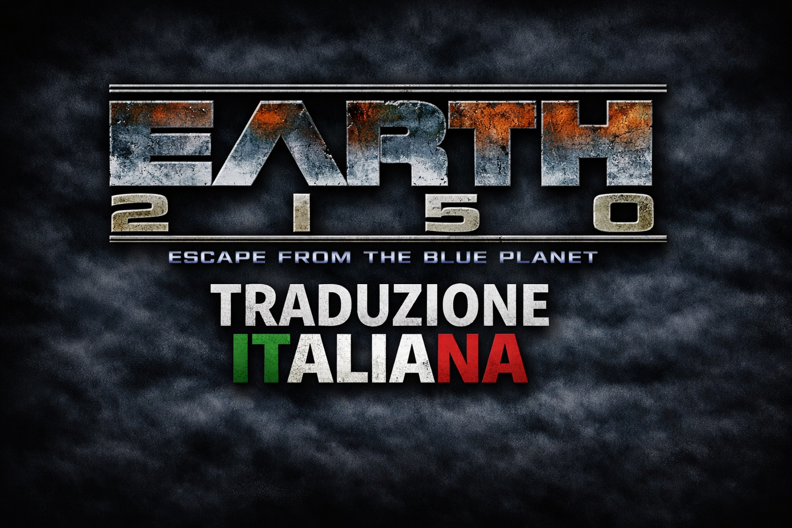
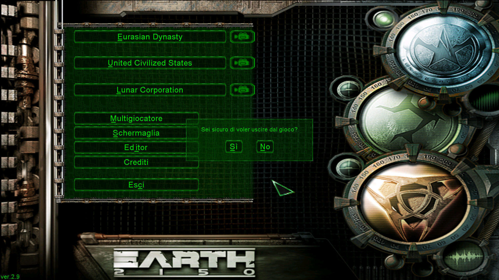
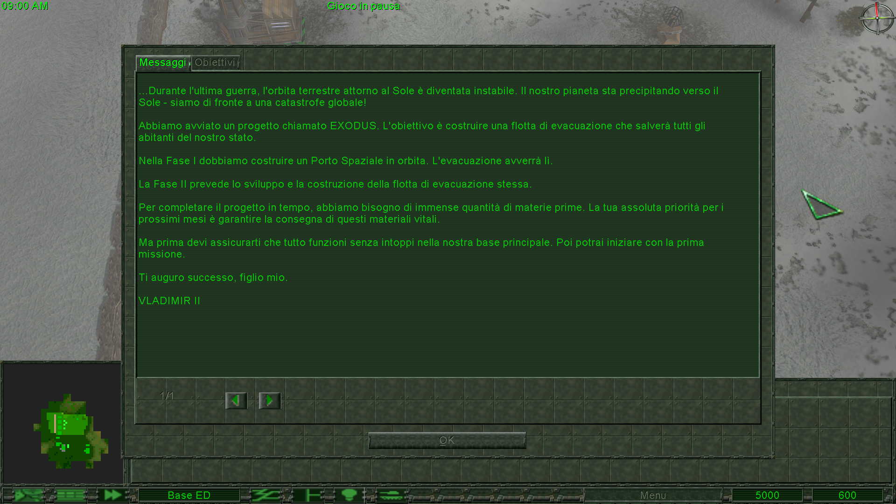
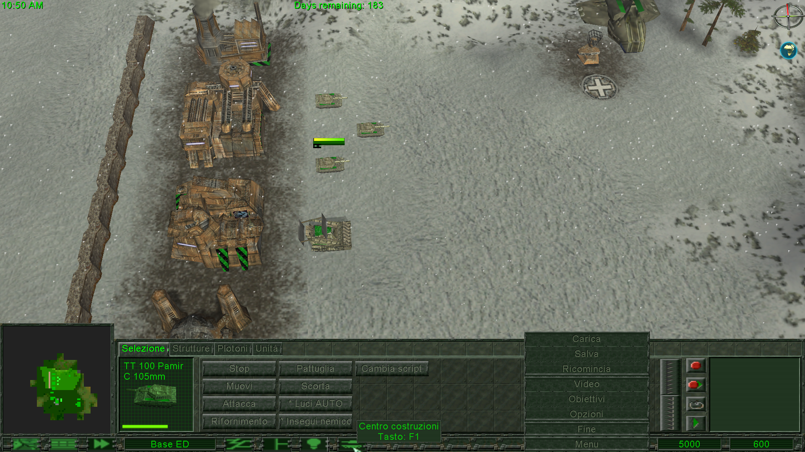
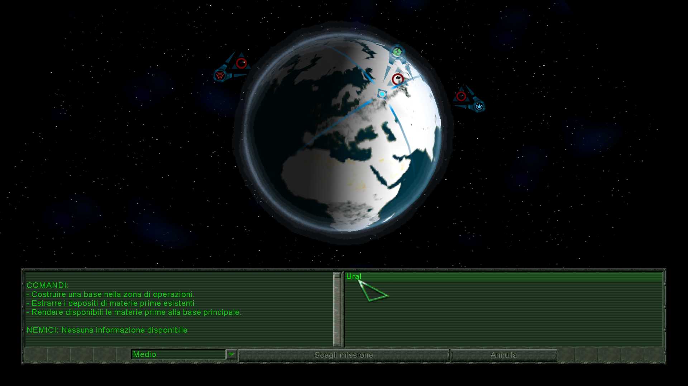
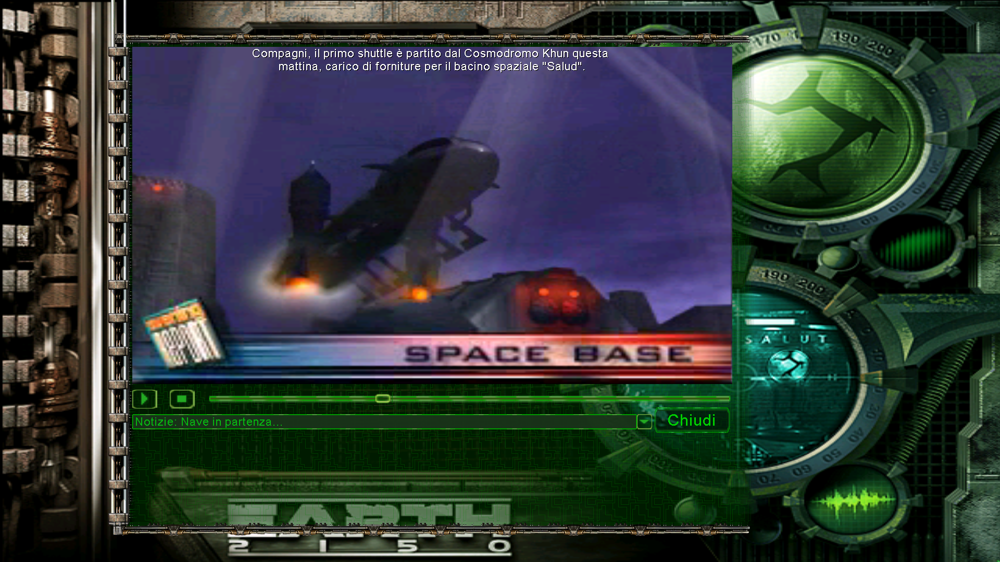

# Earth-2150-EFTBP-Italian-Translation
Traduzione italiana di Earth 2150: Escape from the Blue Planet.

Include:
- messaggi della campagna
- sottotitoli dei video
- menù di gioco

Testata su:
- versione GOG Games **2.8.7.1**
- aggiornata con **Patch Inside Earth 2.9**

---

## Stato della traduzione
**Versione attuale: v0.9 — Traduzione giocabile**

Da completare:
- editor mappe
- voci multigiocatore
- Crediti

---

## Installazione

### Metodo consigliato (GOG + Patch Inside Earth 2.9)

Copia il file:

`Language_it.wd`

nella cartella:

`WDFiles`

che si trova nella directory principale del gioco (GOG Games 2.8.7.1 + Patch 2.9).

### Metodi alternativi

- Tentare la **sostituzione** del file originale `Language.wd`.
- Se usi una versione del gioco **senza file compressi `.wd`**, prova a sostituire:
  - `language.lan`
  - `subtitles.txt`

---
 
## Contribuire

Se vuoi contribuire alla traduzione:

- Apri una **issue** per segnalare errori o suggerire miglioramenti.
- Usa le discussions per domande generiche, suggerimenti, feedback o per parlare del progetto.
- Puoi proporre modifiche ai testi tramite i file **.txt** o **.lan**.
- Le pull request sul file **Language.wd** verranno valutate solo se accompagnate dalle modifiche ai file contenuti al suo interno.

Una mini guida tecnica sulla struttura dei file e sul processo di ricostruzione verrà aggiunta in seguito.

Grazie a chiunque voglia contribuire al miglioramento della traduzione italiana di *Earth 2150: Escape from the Blue Planet*.

---

## Nota legale

Questa traduzione è una modifica non ufficiale dei file di gioco di Earth 2150: Escape from the Blue Planet.
I contenuti originali rimangono di proprietà dei rispettivi detentori dei diritti.
La traduzione italiana è distribuita gratuitamente e senza scopo di lucro.
Questo progetto non è affiliato né supportato dagli sviluppatori o dai publisher originali.

---

## link

**Pagina ModDB:** "https://www.moddb.com/mods/earth2150-eftbp-traduzioneitaliana"

---

## Screenshots

Ecco alcune anteprime della traduzione italiana in gioco:

